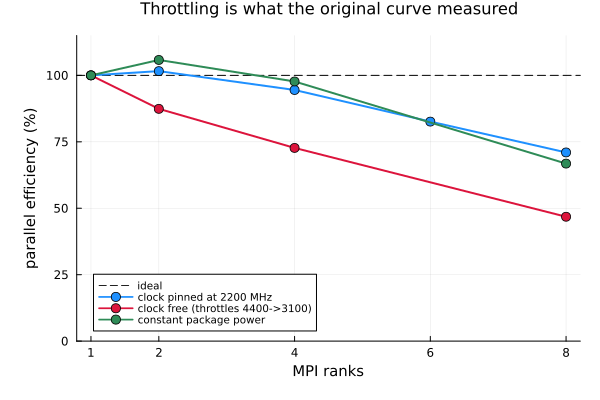
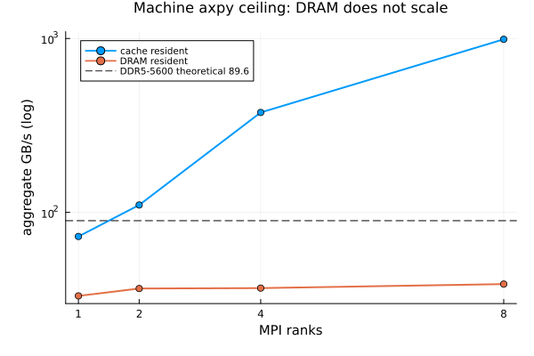
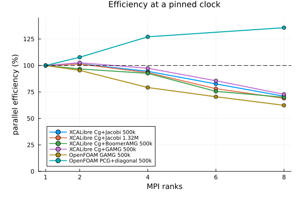
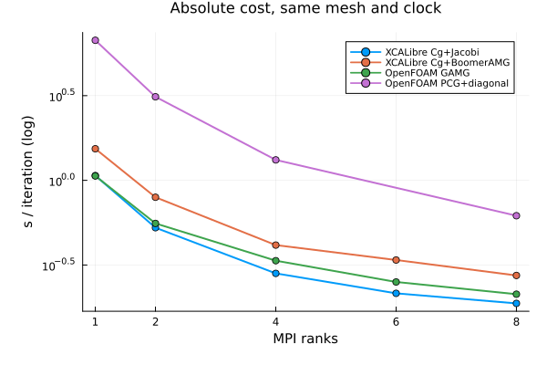

# Distributed (MPI) strong-scaling summary

Backward-facing step, laminar, incompressible, Float64 on CPU. All timings are
`(t100 - t3) / 97` s per SIMPLE iteration, which cancels JIT and setup cost. One MPI rank per
physical P-core, verified from each rank's kernel affinity mask.

Data: [`dev/telemetry/scaling.csv`](scaling.csv),
[`machine_bandwidth.csv`](machine_bandwidth.csv),
[`petsc_events.csv`](petsc_events.csv).
Plots: `dev/telemetry/plots/` — regenerate with `julia dev/scripts/plot_scaling.jl`.

---

## 1. The headline: measure with the clock pinned, or measure nothing

This machine (i9-14900HX, 8 P-cores) drops from 4400 MHz on one busy core to 3100 MHz on eight.
Rank count and clock therefore co-vary, and an uncorrected strong-scaling curve measures the
laptop's power limit rather than the code.

| 499,503 cells | n=2 | n=4 | n=6 | n=8 |
|---|---:|---:|---:|---:|
| clock free (what we first measured) | 87% | 73% | - | 47% |
| **clock pinned at 2200 MHz** | **102%** | **94%** | **83%** | **71%** |
| constant package power (cross-check) | 106% | 98% | - | 67% |

Two independent controls agree: pinning the clock in hardware (`no_turbo=1`), and loading every
otherwise-idle P-core with spin loops so all rank counts throttle equally. The commands for both
are in `dev/gotchas.md`.

## 2. Efficiency is independent of mesh size

| pinned at 2200 MHz | n=2 | n=4 | n=6 | n=8 |
|---|---:|---:|---:|---:|
| 499,503 cells | 101.6% | 94.5% | 82.6% | 71.0% |
| 1,320,368 cells | 101.4% | 93.3% | 78.1% | 69.0% |

A 2.6x larger mesh reproduces the curve to within a few points. This rules out two explanations
at once: a communication-bound loss would **improve** with the better volume-to-surface ratio,
and a DRAM-bandwidth-bound loss would **worsen** with a working set of 32 MB instead of 12 MB.
Neither happens, so the loss is a fixed fraction of the work.

## 3. Is there a regression from n=6 to n=8? No.

Cumulative efficiency always falls, which makes 83% -> 71% look like a cliff. The marginal cost
of each added rank tells the real story:

| incremental efficiency | 1->2 | 2->4 | 4->6 | 6->8 |
|---|---:|---:|---:|---:|
| 499,503 cells | 102% | 93% | 87% | **86%** |
| 1,320,368 cells | 101% | 92% | 84% | **88%** |

The 6->8 step costs the same as the 4->6 step, on both meshes. There is no step change at full
core occupancy: the degradation is gradual and monotone from n=4 onward, and the n=8 point is
not anomalous.

## 4. Where the remaining loss is

From PETSc `-log_view` at 499,503 cells:

| event | n=2 | n=8 | rank imbalance at n=8 |
|---|---:|---:|---:|
| `KSPSolve` | 6.90 s | 5.12 s | 2.1x |
| `VecNorm` | 0.14 s (2% of solve) | **2.73 s (53% of solve)** | **38.2x** |
| `MatMult` | 4.77 s | 2.93 s | 1.8x |

Excluding `VecNorm`, the solve scales at 71% rather than 34% from two ranks to eight. The 38x
imbalance is *arrival spread*: ranks reach the all-reduce at different times and wait. METIS
balances owned cells to 1.001 but leaves ghost counts at 3.63x, so ranks do unequal halo work.
Changing the METIS objective does not fix it (volume cuts total ghosts 11% and leaves imbalance
at 3.66 against 3.63).

## 5. The machine's own ceiling

MPI `axpy`, the same kernel as PETSc's `VecAXPY`, aggregate GB/s:

| working set | n=1 | n=2 | n=4 | n=8 |
|---|---:|---:|---:|---:|
| cache resident | 72.7 | 110.3 | 375.4 | 989.0 |
| DRAM resident | 33.1 | 36.5 | 36.7 | **38.7** |

**DRAM bandwidth does not scale on this machine.** One core nearly saturates it; eight cores buy
17%. Cache bandwidth scales 13.6x. DDR5-5600 dual channel is 89.6 GB/s theoretical.

Placing PETSc against that ceiling:

- `VecAXPY` reaches 104.6 GB/s at n=2 — above the DRAM peak, so it never leaves cache — against
  a measured cache ceiling of 110.3. **PETSc runs at 95% of what the hardware allows.**
- `MatMult` streams a 54 MB matrix that cannot fit the 36 MB L3, at 15.8 to 25.7 GB/s against the
  flat 38.7 GB/s ceiling. This one term genuinely is DRAM-bound.

## 6. Against OpenFOAM, same mesh, same machine, both pinned at 2200 MHz

| n | XCALibre Cg+Jacobi | OpenFOAM GAMG | XCALibre eff | OF eff |
|---|---:|---:|---:|---:|
| 1 | 1.0665 | 1.0620 | 100% | 100% |
| 2 | 0.5251 | 0.5567 | 102% | 95% |
| 4 | 0.2822 | 0.3354 | 94% | 79% |
| 6 | 0.2152 | 0.2511 | 83% | 71% |
| 8 | 0.1877 | 0.2127 | 71% | 62% |

XCALibre matches OpenFOAM's production multigrid per iteration **using only Jacobi**, and scales
better at every rank count.

Running OpenFOAM with the *same* algorithm XCALibre uses (PCG + diagonal):

| n | OF PCG+diagonal | OF efficiency | XCALibre is |
|---|---:|---:|---:|
| 1 | 6.7125 | 100% | 6.29x faster |
| 2 | 3.1138 | 108% | 5.93x faster |
| 4 | 1.3201 | 127% | 4.68x faster |
| 8 | 0.6181 | **136%** | 3.29x faster |

**A slow baseline manufactures high efficiency.** OF PCG+diagonal scales superlinearly only
because its one-rank case is 6.3x slower and badly memory-starved, so extra ranks bring cache
that the baseline never had. Efficiency percentages are comparable only between configurations
of similar absolute speed — comparing a fast code's efficiency against a slow one's is
meaningless.

## 7. Preconditioners and remedies tested

All at 499,503 cells, clock pinned. Efficiency in brackets.

| n | Cg+Jacobi | Cg+BoomerAMG | Cg+GAMG | OpenFOAM GAMG |
|---|---:|---:|---:|---:|
| 1 | 1.0665 (100%) | 1.5359 (100%) | 1.6000 (100%) | 1.0620 (100%) |
| 2 | 0.5251 (102%) | 0.7945 (97%) | 0.7797 (**103%**) | 0.5567 (95%) |
| 4 | 0.2822 (94%) | 0.4146 (93%) | 0.4108 (**97%**) | 0.3354 (79%) |
| 6 | 0.2152 (83%) | 0.3385 (76%) | 0.3116 (**86%**) | 0.2511 (71%) |
| 8 | **0.1877** (71%) | 0.2744 (70%) | 0.2749 (**73%**) | 0.2127 (62%) |

**Cg+Jacobi is the fastest configuration on this case; GAMG has the flattest scaling curve.**
GAMG beats BoomerAMG at every rank count on efficiency at identical cost, and beats Jacobi's
curve too — but is still 1.46x slower in absolute terms, because 500k cells of laminar BFS is
small and well conditioned enough that no AMG setup amortises.

### Hierarchy reuse: freeze versus coefficient update

The two AMG options differ fundamentally in what "reuse" means, and the difference is measurable.

| configuration | n=4 s/iter | what happens between solves |
|---|---:|---|
| GAMG, `reuse_interpolation=true`, `freeze=1` | **0.4108** | aggregation and P kept; RAP and smoothers recomputed from the current matrix |
| GAMG, `reuse_interpolation=false` | 1.1060 | full hierarchy rebuild every solve |
| BoomerAMG, `freeze=1` | 0.8416 | full hypre rebuild every solve |
| BoomerAMG, `freeze=5` | 0.4671 | frozen 4 solves in 5 |
| BoomerAMG, `freeze=10` (default) | 0.4216 | frozen 9 solves in 10 |
| BoomerAMG, `freeze=25` | **0.3951** | frozen 24 solves in 25 |
| BoomerAMG, `freeze=50` | 0.4260 | staleness now costs more than the rebuild saves |

**The coefficient-only update is worth 2.69x** and is the better mechanism: it beats BoomerAMG's
freeze (2.0x) while never applying a stale preconditioner. `BoomerAMG(freeze=N)` calls
`KSPSetReusePreconditioner`, which skips `PCSetUp` entirely — those N-1 solves use operators
built from an older matrix. PETSc's `PCHYPRE` exposes no numeric-only re-setup, so freeze or
rebuild is all that is reachable for hypre. The BoomerAMG default of 10 leaves about 6% against 25 in time but ends with a 2.4x smaller pressure residual, so it stays (D39).

### Rank invariance

| preconditioner | pressure residual after 100 iterations, n=1 to n=8 |
|---|---|
| Jacobi | identical to 15 significant figures |
| GAMG | 0.3% spread |
| BoomerAMG | **2.4x spread** (7.85e-5 to 1.89e-4) |

An AMG hierarchy is built from the local partition, so it changes with rank count; the answer
converges to the same place but by a different path. This is why the scaling attribution work
used Cg+Jacobi throughout. It is a property to document, not a defect — but it does mean AMG
runs are not reproducible across rank counts, and BoomerAMG's freeze schedule compounds it.

### Pipelined CG

`PipeCG` + Jacobi costs 0.2200 s/iter at eight ranks against `Cg`'s 0.1877, 17% slower, with
`KSP=pipecg` confirmed in the solver log. The extra per-iteration work needed to enable the
reduction overlap exceeds the barrier wait it hides at this scale.

## 8. Correctness

With `Jacobi`, residuals are identical across every rank count to 15 significant figures on both
meshes. Partitioning changes nothing about the answer.

With either AMG preconditioner this no longer holds exactly, because the hierarchy is built from
the local partition (see section 7). The solutions converge to the same place by different paths;
the spread is 0.3% for GAMG and 2.4x for BoomerAMG after a fixed 100 iterations.

## 9. What this means in practice

- Scaling to four ranks is essentially free (93-94%); to eight it costs about 30%.
- Prefer fewer, larger subdomains. Each Krylov iteration ends in a global reduction, and small
  subdomains spend a growing share of each iteration waiting at it.
- Do not exceed one rank per physical core.
- Expect a workstation or node with a sustained clock to beat these figures; a laptop cannot hold
  its clock under full load.
- The open optimisation is the reduction count, not bandwidth and not halo exchange: the Krylov
  solves issue roughly 75 reductions per outer iteration.
- Use `Cg() + Jacobi()` on cases of this size and conditioning. Reach for `GAMG()` rather than
  `BoomerAMG()` when AMG is warranted: same cost, better scaling, a real coefficient-only update
  instead of a freeze, and far better rank invariance.
- Our AMG is the weak component, not the distributed module: OpenFOAM's GAMG beats our BoomerAMG
  by 1.24x to 1.45x, while our Cg+Jacobi beats OpenFOAM's GAMG by 6% to 16% above one rank.

## 10. Corrections to earlier findings

Three claims made earlier in this work were wrong and are withdrawn:

1. **"The ceiling is memory bandwidth" (D16, withdrawn by D19).** Inferred from `VecAXPY`
   scaling at 63% without ever checking the rate against the machine's peak. It runs entirely in
   cache at 95% of the achievable rate.
2. **"XCALibre scales 29 points worse than OpenFOAM" (withdrawn by D22).** The OpenFOAM clocks
   were sampled *after* `foamRun` exited, so they read idle cores, and the comparison set
   XCALibre's Cg+Jacobi against OF's PCG+diagonal rather than its production GAMG. Corrected,
   XCALibre scales *better* at every rank count.
3. **"Communication-volume imbalance is the proximate cause" (D15, withdrawn by D16).**

Decisions D19-D24 in `dev/decisions.md` record each correction and its evidence.
