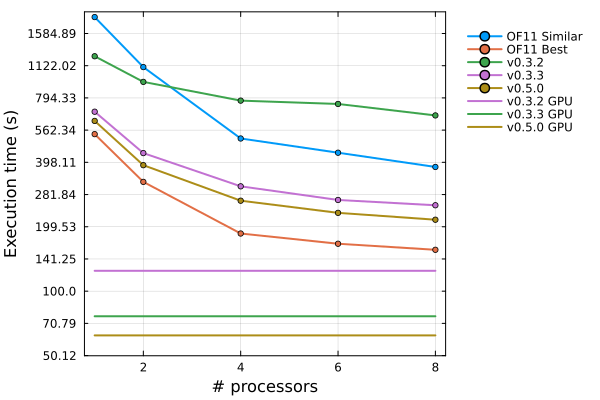
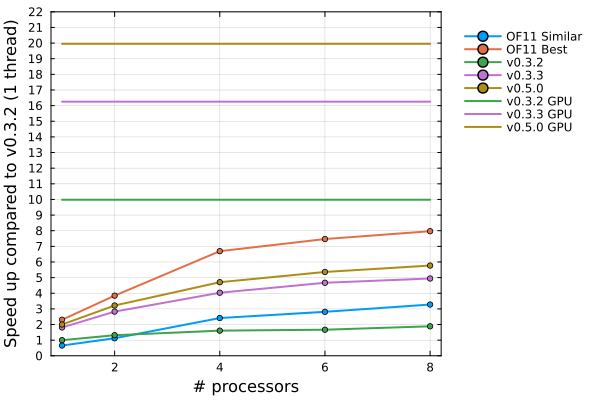
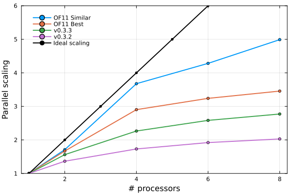

# Benchmarks

*Exploring the performance of `XCALibre.jl`*

## Introduction
---

This space will be used to explore the performance of various flow solvers and `XCALibre.jl` more broadly, and tests/benchmarks will be added as they become available. Eventually, our hope is to have benchmarks for all the solvers available in `XCALibre.jl`, but this will take time. Users are welcome to share their own benchmarks.

In general, it is accepted that benchmarking code is no easy task. Benchmarks that explore relative performance between different functionality within the same codebase tend to be easier, or more reliable. However, when comparing performance of "similar" functionality between different codebases is particularly challenging, and comparing the performance of different CFD codes is no exception. This is due to different implementation choices, difference in numerics, algorithm differences, etc., etc. Thus, it should be stressed that any results discussed herein should be accepted in this context. To enable some degree of transparency, our goal is to make all benchmark results and setup available to the community for scrutiny. Benchmark cases will be published in a separate Github repository, [`XCALibre_benchmarks`](https://github.com/mberto79/XCALibre_benchmarks). Any errors or methodology inconsistencies identified by the community can be identified, and we encourage user to report them.

Due to licensing considerations, it is not possible to report any direct benchmarks comparing performance between `XCALibre.jl` and commercial CFD codes. Thus, unless otherwise stated, the benchmarks included here are all likely to compare performance against [OpenFOAM (foundation)](https://openfoam.org/) or [OpenFOAM (ESI)](https://www.openfoam.com/). Specific versions used will be reported (and updated as far as possible). It should be stressed that the main `XCALibre.jl` developers are all OpenFOAM users and we hold this CFD package is very high regard, and as an established open-source CFD code it makes a perfect candidate to use in our benchmarking efforts, especially for ouf CPU implementation performance. 

This page will be updated as new results become available, but do bare with us, this exercise will take time. Thanks!

## Laminar incompressible solver (3D)
---

### Case and set up information

In this first benchmark, the performance of the *laminar solver* implementation in `XCALibre.jl` is explored. The configuration corresponds to a backward-facing step geometry with a mesh with approximately 500,000 cells. The test case mesh file, along with setup files for both `XCALibre.jl` and OpenFOAM can be found [here](https://github.com/mberto79/XCALibre_benchmarks/tree/main/3D_BFS_laminar).

The following cases were tested:

| Case    | Code | Version | Backend |Variable | Solver | Preconditioner |
| -------- | ----|---------|---------|---------|--------|---------------|
| OF11 Similar | OpenFOAM  | OpenFOAM 11 (foundation) | CPU | Velocity \\ Pressure | PBiCGStab \\ PCG | diagonal \\ diagonal |
| OF11 Best | OpenFOAM  | OpenFOAM 11 (foundation) |  CPU |Velocity \\ Pressure | PBiCGStab \\ GAMG | DILU \\ none |
| v0.3.2 | `XCALibre.jl` | v0.3.2 (Julia v0.10.6)  |  CPU |Velocity \\ Pressure | BiCGStab \\ CG | diagonal \\ diagonal |
| v0.3.3 | `XCALibre.jl` | v0.3.3 (Julia v0.10.6)  |  CPU |Velocity \\ Pressure | BiCGStab \\ CG | diagonal \\ diagonal |
| v0.5.0 | `XCALibre.jl` | v0.5.0 (Julia v0.11.5)  |  CPU |Velocity \\ Pressure | BiCGStab \\ CG | diagonal \\ diagonal |
| v0.3.2 GPU | `XCALibre.jl` | v0.3.2 (Julia v0.10.6)  |  GPU |Velocity \\ Pressure | BiCGStab \\ CG | diagonal \\ diagonal |
| v0.3.3 GPU | `XCALibre.jl` | v0.3.3 (Julia v0.10.6)  |  GPU |Velocity \\ Pressure | BiCGStab \\ CG | diagonal \\ diagonal |
| v0.5.0 GPU | `XCALibre.jl` | v0.5.0 (Julia v0.11.5)  |  GPU |Velocity \\ Pressure | BiCGStab \\ CG | diagonal \\ diagonal |

Notice that the `OF11 Similar` case aims to provide a configuration in OpenFOAM that is comparable to the numerical setup used (and available) in `XCALibre.jl`. The `OF11 Best` uses the most performant setup available in OpenFOAM, in terms of the linear solver and preconditioner combination. Discretisation schemes and solver tolerance are kept as similar as possible for all cases. The `XCALibre.jl` test cases aim to provide relative performance between difference versions and backends.

### Hardware

All tests were performed on an ASUS TUF Gaming A15 FA506 with 16Gb of RAM, an AMD Ryzen™ 7 4800H CPU and. GPU test cases ran on the laptop's NVIDIA RTX 2060 with 6Gb of VRAM. Ubuntu 21.04 LTS was the operating system and it was set up to "performance" mode to ensure that power was reduced during tests (particularly important of GPU tests).

### Results

The execution time for the various test cases is shown in the figure below. This is the total time required to complete 500 iterations. This includes memory allocation time and a single write-to-file event. The cases were run with an increasing number of CPUs, ranging from 1 to 8 CPU cores.

Firstly, the results show that there has been a substantial performance improvement in the latest version of `XCALibre.jl` (v0.3.3). In version v0.3.2, `XCALibre.jl` was generally slower than OpenFOAM when using a similar numerical setup (*OF11 Similar*), with the exception of cases where low CPU cores were used. In v0.3.3, `XCALibre.jl` is showing faster computing than the *OF11 Similar* regardless of the number of cores used. However, when OpenFOAM is setup using the more advanced solvers (i.e. GAMG) and preconditioners available (e.g. DILU), it achieves a further reduction in compute time. However, when executing on a modest NVIDIA RTX 2060 GPU backend, `XCALibre.jl` is able to complete the calculation at even lower computation times. 

To better understand the performance gains achieved in `XCALibre.jl` v0.3.3, the relative computation time is plotted in the figure below. Notice that the "speed up" figures shown are found by dividing the runtime for a given case with the simulation time for a single core run when using v0.3.2. In a nutshell, the results show that v0.3.3 achieves performance gains in the range of 2-5x. Also, the most performance configuration in OpenFOAM (*OF11 Best*) has gains in the range of 2-8x. This is encouraging, but highlights that there is still room to improve performance in the CPU implementation of the laminar solver in `XCALibre.jl`. It is also encouraging to see that `XCALibre.jl` GPU performance is significantly faster that both OpenFOAM and `XCALibre.jl` (on CPU) with a speed up of approximately 17x. A considerable performance  gain for the GPU implementation is also achieved in v0.3.3 compared to v0.3.2. Internally, the major change was a change of the sparse matrix storage format from CSC to CSR, which allows the use of optimised sparse matrix operations (available in `CUDA.jl`), but also the re-implementation of some kernel to take advantage of the row storage used in the CSR format. Further performance improvements were achieved in v0.5.0 by implementing better logic for assigning boundary conditions, as well as more robust boundary condition implementations.

Lastly, the scaling behaviour of the codes has been explored and shown in the figure below. In a nutshell, OpenFOAM shows the best scaling overall, specially for case *OF1 Similar*. The latest version of `XCALibre.jl` is showing a similar trend to the *OF11 Best* case, but the results point to the need to further improve the implementation in `XCALibre.jl` to improve its scaling behaviour.

