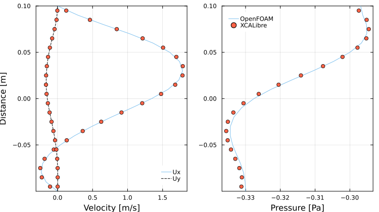

# Verification: 2D incompressible backward-facing step

# Introduction
---

The correct implementation of the laminar solver in XCALibre.jl has been verified by quantitatively comparing results with those obtained with OpenFOAM. The simulation set up and mesh file used to run the simulation with XCALibre.jl are available in this repository.

# Simulation setup
---

```jldoctest;  filter = r".*"s => s"", output = false

using XCALibre
# using CUDA # Uncomment to run on NVIDIA GPUs
# using AMDGPU # Uncomment to run on AMD GPUs

grids_dir = pkgdir(XCALibre, "examples/0_GRIDS")
grid = "backwardFacingStep_10mm.unv"
mesh_file = joinpath(grids_dir, grid)

mesh = UNV2D_mesh(mesh_file, scale=0.001)

# Select backend and setup hardware
backend = CPU()
# backend = CUDABackend() # ru non NVIDIA GPUs
# backend = ROCBackend() # run on AMD GPUs

hardware = set_hardware(backend=backend, workgroup=1024)
# hardware = set_hardware(backend=backend, workgroup=32) # use for GPU backends

mesh_dev = mesh # use this line to run on CPU
# mesh_dev = adapt(backend, mesh)  # Uncomment to run on GPU 

velocity = [1.5, 0.0, 0.0]
nu = 1e-3
Re = velocity[1]*0.1/nu

model = Physics(
    time = Steady(),
    fluid = Fluid{Incompressible}(nu = nu),
    turbulence = RANS{Laminar}(),
    energy = Energy{Isothermal}(),
    domain = mesh_dev
    )

BCs = assign(
    region=mesh_dev,
    (
        U = [
            Dirichlet(:inlet, velocity),
            Extrapolated(:outlet),
            Wall(:wall, [0.0, 0.0, 0.0]),
            Wall(:top, [0.0, 0.0, 0.0])
        ],
        p = [
            Extrapolated(:inlet),
            Dirichlet(:outlet, 0.0),
            Wall(:wall),
            Wall(:top)
        ]
    )
)

schemes = (
    U = set_schemes(divergence = Linear),
    p = set_schemes() # no input provided (will use defaults)
)

solvers = (
    U = set_solver(
        region = mesh_dev,
        solver      = Bicgstab(), # Options: Gmres()
        preconditioner = Jacobi(), # Options: NormDiagonal()
        convergence = 1e-7,
        relax       = 0.7,
        rtol = 1e-4,
        atol = 1e-10
    ),
    p = set_solver(
        region = mesh_dev,
        solver      = Cg(), # Options: Cg(), Bicgstab(), Gmres()
        preconditioner = Jacobi(), # Options: NormDiagonal()
        convergence = 1e-7,
        relax       = 0.7,
        rtol = 1e-4,
        atol = 1e-10
    )
)

runtime = set_runtime(iterations=2000, time_step=1, write_interval=2000)
runtime = set_runtime(iterations=1, time_step=1, write_interval=-1) # hide

config = Configuration(
    solvers=solvers, schemes=schemes, runtime=runtime, hardware=hardware, boundaries=BCs)

initialise!(model.momentum.U, velocity)
initialise!(model.momentum.p, 0.0)

residuals = run!(model, config);


# output

```

# Results
---

## Domain and mesh


## OpenFoam solution


## XCALibre solution


## Quantitative comparision

The figure below compares the results obtained with OpenFOAM and XCALibre.jl. The profiles are extracted along the y-direction at x = 0.5 m. 
