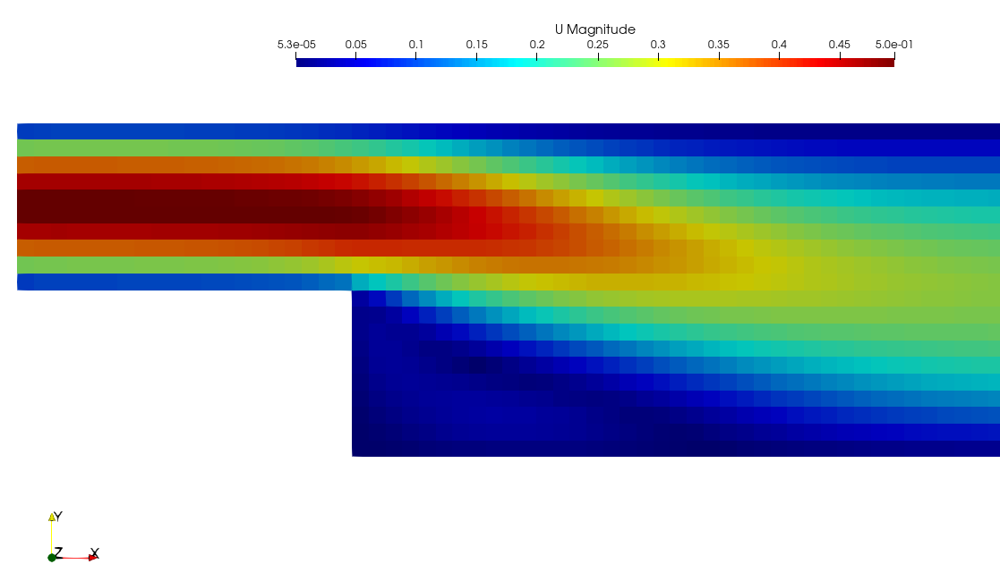

# Advanced: 2D inflow using `Flux.jl`

# Introduction
---

In this example a simple neural network is constructed and used to define an inlet boundary condition for the x-component of the velocity vector. This example serves to illustrate how other packages from the Julia ecosystem can be integrated into `XCALibre.jl` to extend its functionality. In particular, this example will show how to build a basic neural network using `Flux.jl` to represent a parabolic velocity profile and how this neural network can be used to define an inlet condition in `XCALibre.jl`. 

The boundary condition is injected into the solution using the builtin `DirichletFunction` boundary condition, which is designed to pass arbitrary Julia functions to a given boundary.

```@docs; canonical=false
XCALibre.Discretise.DirichletFunction
```

In this example, instead of passing a Julia function, the boundary velocity profile will be given via a simple neural network. 

!!! note
    
    This interface is experimental and subject to change. Currently it can only be used for vectors.

# Set up steps
---


### Install and load modules

To be able to run this example the following modules need to be installed. This can be done by entering into package mode (using "]" in the REPL) and typing the following:

```julia
add Plots, XCALibre, Flux, StaticArrays, LinearAlgebra, KernelAbstractions, Adapt
```

This will download and install the required packages. Once installed, the packages can be loaded as follows:

```@example flux
using Plots
using XCALibre
using Flux
using StaticArrays
using Statistics
using LinearAlgebra
using KernelAbstractions
nothing # hide
```

### Build a neural network model

Next, a neural network will be created to return a parabolic velocity profile. In this case, the training data will be generated using an analytical expression. 

```@example flux

actual(y) = begin
    H = 1 # channel height
    H2 = H/2
    h = y - H2
    vx = (1 - (h/H2)^2)
    return vx
end

```

And define a simple 2-layer neural network to model the inlet function:

```@example flux
inflowNetwork = Chain(
    Dense(1 => 6, sigmoid),
    Dense(6 => 1)) |> f64
```

Now, we generate the training and testing datasets using the analytical function. The neural network is not yet trained but it can already be used (of course, the prediction is not yet very useful). The various datasets, and initial model predictions are shown in the figure below.

```@example flux

y_actual = [0:0.01:1;] # array of y-values for plotting
vx_actual = actual.(y_actual)

# Generate training dataset
y_train = hcat(rand(0:(0.1/100):0.1, 100)...)./0.1
vx_train = actual.(y_train)

# Test locations selected randomly
y_test = hcat(rand(0:(0.1/100):0.1, 100)...)./0.1
vx_untrained = inflowNetwork(y_test)

plot(
    y_actual, vx_actual, label="Actual", 
    frame_style=:box, foreground_color_legend = nothing,
    xlabel="Dimensionless distance", ylabel="Normalised velocity")
scatter!(y_train', vx_train', label="Training data")
scatter!(y_test', vx_untrained', label="Untrained output")
savefig("flux_comparison_untrained.svg"); nothing # hide
```


The next step is to train the model as shown below. Finally, to make sure that the model has trained correctly, it is tested with at randomly generated points and the output compared with the analytical function as shown in the figure below.

```@example flux

loss(inflowNetwork, y, vx) = mean(abs2.(inflowNetwork(y) .- vx))

opt =  Flux.setup(Adam(), inflowNetwork)
data = [(y_train, vx_train)]
for epoch in 1:20000
    Flux.train!(loss, inflowNetwork, data, opt)
end
loss(inflowNetwork, data[1]...,)

vx_trained = inflowNetwork(y_test)


plot(
    y_actual, vx_actual, label="Actual", 
    frame_style=:box, foreground_color_legend = nothing,
    xlabel="Dimensionless distance", ylabel="Normalised velocity")
scatter!(y_test', vx_trained', label="Trained output")
savefig("flux_comparison.svg"); nothing # hide
```


### Define inlet condition and interface

The next step is to define some interfaces to allow passing the model as if it was a simple Julia function. This requires only 3 key ingredients. First, a struct is defined that will contain any user data needed as well as the model itself. In this case, the following structure has been used (but users are completely free to define their own structures).  The only requirements are that the structure should be a subtype of `XCALibreUserFunctor` and it must contain the `steady` property.

```@example flux
struct Inflow{F,I,O,N,V,T} <: XCALibreUserFunctor
    U::F        # maximum velocity
    H::F        # inlet height
    input::I    # vector to hold input coordinates
    output::O   # vector to hold model inferred values
    network::N  # model itself
    xdir::V     # struct used to define x-direction unit vector
    steady::T   # required field! (Bool)
end
```

Second, the struct above is used as a functor, defined following the requirements set by the `DirichletFunction` boundary condition. Essentially, this allows for external data to be stored in the `Inflow` object, which is then made "callable" to behave as a simple Julia function that returns the velocity vector at a given coordinate (`vec`) and time (`t`).

```@example flux
(bc::Inflow)(vec, t, i) = begin
    velocity = @view bc.output[:,i]
    return @inbounds SVector{3}(velocity[1], velocity[2], velocity[3])
end
```

The third step is to define a new method for the `update_user_boundary!` function from the `Discretise` module. This function offers a mechanism to update the internals of the previously defined structure by calling the user-provided neural network model. In this particular example, this is not required since the boundary values are not changing in time (it would have been sufficient to do a single inference round and to simply store the values inside the `Inflow` struct). However, this function is implemented here to illustrate the interface, and provide an example of a user-defined kernel. Notice that, in this particular example, the only purpose of this function is to scale the velocity field inferred by the neural network (since it was defined with values between 0 and 1).

```@example flux

XCALibre.Discretise.update_user_boundary!(
    BC::DirichletFunction{I,V}, eqnModel, component, faces, cells, facesID_range, time, config
    ) where{I,V<:Inflow} = 
begin

    (; hardware) = config
    (; backend, workgroup) = hardware

    kernel_range = length(facesID_range)
    kernel! = _update_user_boundary!(backend, workgroup, kernel_range)
    kernel!(BC, eqnModel, component, faces, cells, facesID_range, time, ndrange=kernel_range)
    KernelAbstractions.synchronize(backend)

    (; output, input, U, network, xdir) = BC.value
    output .= U.*network(input).*xdir # convert to vector
end

@kernel function _update_user_boundary!(BC, eqnModel, component, faces, cells, facesID_range, time)
    i = @index(Global)
    startID = facesID_range[1]
    fID = i + startID - 1
    coords = faces[fID].centre
    BC.value.input[i] = coords[2]/BC.value.H # scale coordinates
end

```

### Create an instance of  `Inflow` 

An instance of the `Inflow` object is now created. Notice that the `input` and `output` fields contain vectors to hold the boundary face information, thus, they must be of the same size as the number of boundary faces. The mesh is, therefore, loaded first.
```@example flux

grids_dir = pkgdir(XCALibre, "examples/0_GRIDS")
grid = "backwardFacingStep_5mm.unv"
mesh_file = joinpath(grids_dir, grid)

mesh = UNV2D_mesh(mesh_file, scale=0.001)

nfaces = mesh.boundaries[1].IDs_range |> length
```

The `Inflow` functor is now constructed.

```@example flux

U = 0.5 # maximum velocity
H = 0.1 # inlet height
input = zeros(1,nfaces)
input .= (H/2)/H
output = U.*inflowNetwork(input).*[1 0 0]'
@view output[:,2]

inlet_profile= Inflow(
    0.5,
    0.1,
    input,
    output,
    inflowNetwork,
    [1,0,0],
    true
)

```

### Run simulation

The final step is simply to set up and run a simulation in XCALibre.jl. Notice that this does not require any special considerations, only to remember to use the `DirichletFunction` boundary condition when setting the inlet velocity. The `inlet_profile` functor object is then passed to the boundary. 

```@example flux

velocity = [0.5, 0.0, 0.0]
nu = 1e-3
Re = velocity[1]*0.1/nu

model = Physics(
    time = Steady(),
    fluid = Fluid{Incompressible}(nu = nu),
    turbulence = RANS{Laminar}(),
    energy = Energy{Isothermal}(),
    domain = mesh
    )

@assign! model momentum U (
    DirichletFunction(:inlet, inlet_profile), # Pass functor
    Neumann(:outlet, 0.0),
    Dirichlet(:wall, [0.0, 0.0, 0.0]),
    Dirichlet(:top, [0.0, 0.0, 0.0]),
)

@assign! model momentum p (
    Neumann(:inlet, 0.0),
    Dirichlet(:outlet, 0.0),
    Neumann(:wall, 0.0),
    Neumann(:top, 0.0)
)

schemes = (
    U = set_schemes(divergence = Linear),
    p = set_schemes()
)


solvers = (
    U = set_solver(
        model.momentum.U;
        solver      = BicgstabSolver,
        preconditioner = Jacobi(),
        convergence = 1e-7,
        relax       = 0.7,
        rtol = 1e-4,
        atol = 1e-10
    ),
    p = set_solver(
        model.momentum.p;
        solver      = CgSolver,
        preconditioner = Jacobi(),
        convergence = 1e-7,
        relax       = 0.3,
        rtol = 1e-4,
        atol = 1e-10
    )
)

runtime = set_runtime(iterations=500, time_step=1, write_interval=500)
runtime = set_runtime(iterations=1, time_step=1, write_interval=-1) # hide

hardware = set_hardware(backend=CPU(), workgroup=1024)

config = Configuration(
    solvers=solvers, schemes=schemes, runtime=runtime, hardware=hardware)

GC.gc()

initialise!(model.momentum.U, velocity)
initialise!(model.momentum.p, 0.0)

residuals = run!(model, config)

nothing # hide
```

# Simulation result
---

