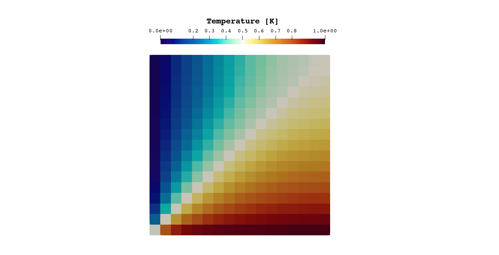
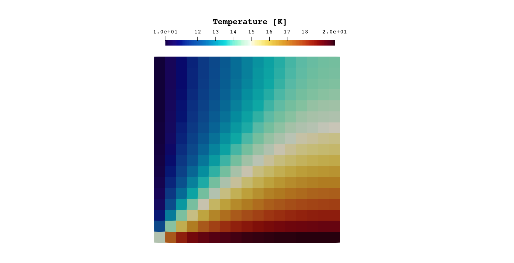

# Validation: Laplace Solver in 2D Solid Medium

# Introduction
---
This tutorial introduces laplace solver that can operate in either steady-state or transient mode, and supports both constant material properties across the domain (`Uniform`) and spatially varying properties (`NonUniform`).

The example simulation below consist of a simple 2D square domain with two Dirichlet walls and two Neumann 0 flux walls. It is expected to produce a diagonal line of constant value when solving laplace/heat equation.

# Mesh
---

The mesh used in this tutorial is a structured 2D grid (the mesh files `laplace_2d_mesh.unv` or `finer_mesh_laplace.unv` can be found in the `examples` directory). The mesh represents a rectangular region with four boundaries:

- `:left_wall`
- `:right_wall`
- `:bottom_wall`
- `:upper_wall`

## Boundary Conditions

|Boundary name | Field | Boundary condition |
| ------------ | ----- | ------------------ |
| `:left_wall` | `T`   | Dirichlet (0.0 K) |
| `:right_wall` | `T`   | Zero-gradient       |
| `:bottom_wall` | `T`   | Dirichlet (1.0 K) |
| `:upper_wall` | `T`   | Zero-gradient       |


# Simulation Setup File
---

```julia
using XCALibre

grids_dir = pkgdir(XCALibre, "examples/0_GRIDS")
grid = "laplace_2d_mesh.unv"
mesh_file = joinpath(grids_dir, grid)
mesh = UNV2D_mesh(mesh_file, scale=0.001)

backend = CPU(); workgroup = 1024; activate_multithread(backend)
hardware = Hardware(backend=backend, workgroup=workgroup)
mesh_dev = adapt(backend, mesh)

model = Physics(
    time = Steady(),
    solid = Solid{Uniform}(k=10.0),
    energy = Energy{Conduction}(),
    domain = mesh_dev
)

left_wall_temp = 0.0
bottom_wall_temp = 1.0

BCs = assign(
    region = mesh_dev,
    (
        T = [     
            Dirichlet(:left_wall, left_wall_temp),
            Zerogradient(:right_wall),
            Dirichlet(:bottom_wall, bottom_wall_temp),
            Zerogradient(:upper_wall)
        ],
    )
)

solvers = (
    T = SolverSetup(
        solver         = Cg(),
        preconditioner = Jacobi(),
        convergence    = 1e-8,
        relax          = 0.8,
        rtol           = 1e-4,
        atol           = 1e-5
    )
)

schemes = (
    T = Schemes(laplacian = Linear)
)

runtime = Runtime(
    iterations=10,
    write_interval=10,
    time_step=1
)

config = Configuration(
    solvers=solvers,
    schemes=schemes,
    runtime=runtime,
    hardware=hardware,
    boundaries=BCs
)

GC.gc(true)

residuals = run!(model, config)

```
# Results
---

The temperature field shows diagonal line of constant temperature of `0.5 K`, as expected:


# Material Properties
---
If time term is set to be transient, the solver expects not only conductivity `k`, but also density `ρ` and specific heat `c_p` values to be passed. Example:


| Property       | Value     | Units         |
|----------------|-----------|---------------|
| `k` (conductivity) | 54.0      | W/m·K         |
| `ρ` (density)      | 7850.0    | kg/m³         |
| `c_p` (specific heat) | 480.0     | J/kg·K        |


```julia
solid = Solid{Uniform}(k=54.0, rho=7850.0, cp=480.0)
```

For higher fidelity simulations, `NonUniform` regime is recommended. It requires density and predefined material to be passed:
```julia
solid = Solid{NonUniform}(material=Aluminium(), rho=2700.0)
```
This will ensure that the solver computes **k** and **cp** for each cell as a function of temperature.  
The general form of the equation for both coefficients is:

``\log(k) = a + b\log(T) + c \log(T)^2 + d \log(T)^3 + e \log(T)^4 + f \log(T)^5 + g \log(T)^6 + h \log(T)^7 + i \log(T)^8``

where *a*, *b*, *c*, *d*, *e*, *f*, *g*, *h*, and *i* are the fitted coefficients, and **T** is the temperature of a cell.

Currently, 3 material models are pre-defined: `Steel()`, `Aluminium()`, and `Copper()`. The coefficients for those materials were taken from [Cryogenic Material Properties Database by Marquardt (2002)](https://www.researchgate.net/publication/226513158_Cryogenic_Material_Properties_Database), and work well for temperatures between 4 and 300 Kelvin. A custom material can also be defined:

```julia
# Define your custom coefficient vectors for k and cp:
k_coeffs = MaterialCoefficients(
    c1=-1.4087, c2=1.3982, c3=0.2543, c4=-0.6260, c5=0.2334,
    c6=0.4256, c7=-0.4658, c8=0.1650, c9=-0.0199
)
cp_coeffs = MaterialCoefficients(
    c1=22.0061, c2=-127.5528, c3=303.6470, c4=-381.0098, c5=274.0328,
    c6=-112.9212, c7=24.7593, c8=-2.239153, c9=0.0
)

# Pass them instead of `material`:
solid = Solid{NonUniform}(k=k_coeffs, cp=cp_coeffs, rho=7850.0),
```


# NonUniform Results

The following settings were changed for this `NonUniform` configuration:

```julia
grid = "finer_mesh_laplace.unv"

model = Physics(
    time = Transient(),
    solid = Solid{NonUniform}(material=Aluminium(), rho=2700.0),
    energy = Energy{Conduction}(),
    domain = mesh_dev
    )

left_wall_temp = 10.0
bottom_wall_temp = 20.0
```



The difference compared to `Uniform` solution with constant properties can be clearly seen. Temperature distribution in cryogenic range is more complex and becomes increasingly non-linear the lower you go. In fact, setting boundary conditions to 0 and 1 Kelvin as in previous case would result in divergence, which is a more realistic result considering that 0 K boundary would violate the third law of thermodynamics.