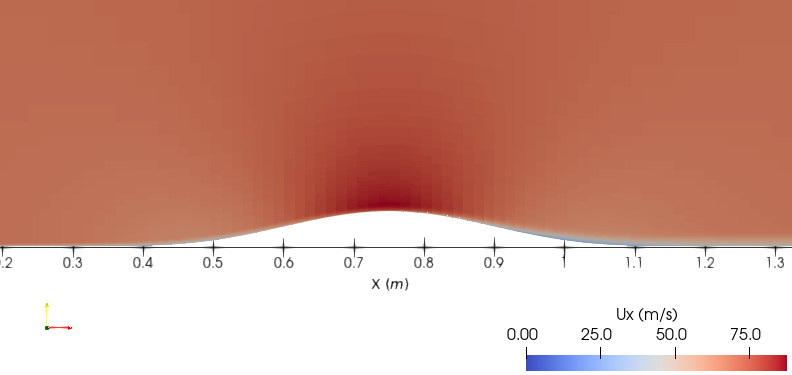
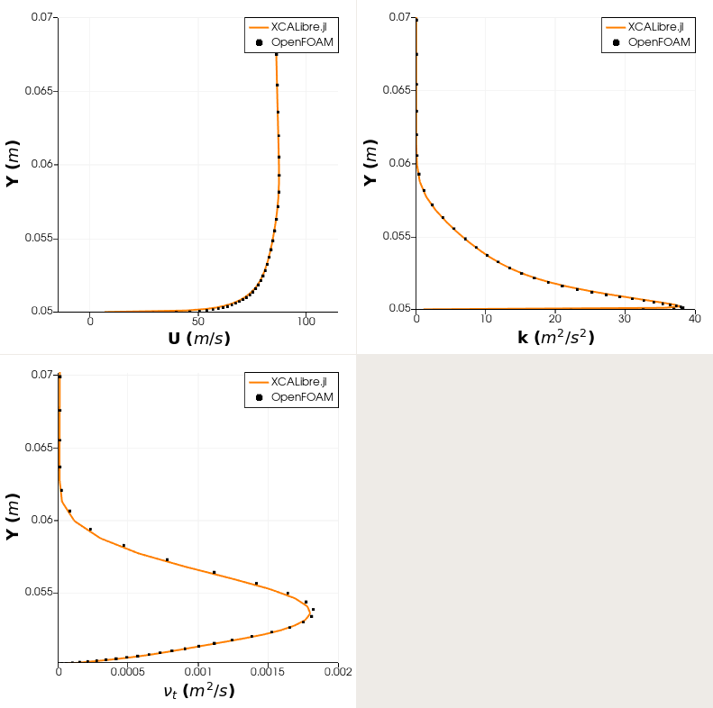
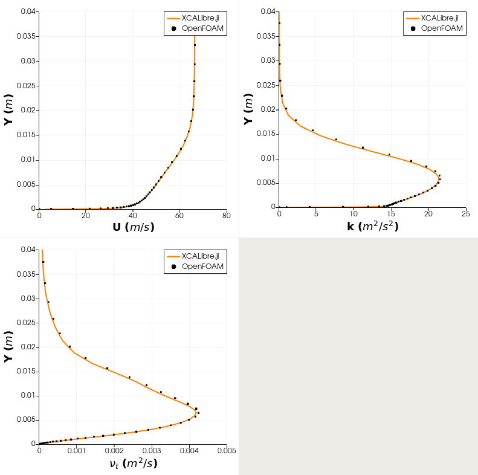

# Verification: 2D bump ``k-\omega`` SST

# Introduction
---

The correct implementation of the ``k-\omega`` SST solver in XCALibre.jl has been verified by quantitatively comparing results with those obtained with OpenFOAM. The simulation set up and mesh file used to run the simulation with XCALibre.jl are available in this repository.

# Simulation setup
---

```jldoctest;  filter = r".*"s => s"", output = false

using XCALibre
# using CUDA # Uncomment to run on NVIDIA GPUs
# using AMDGPU # Uncomment to run on AMD GPUs

grids_dir = pkgdir(XCALibre, "examples/0_GRIDS")
grid = "OF_bump2d/polyMesh"
mesh_file = joinpath(grids_dir, grid)

mesh = FOAM3D_mesh(mesh_file, scale=1, integer_type=Int64, float_type=Float64)

# Select backend and setup hardware
backend = CPU(); workgroup = 1024; activate_multithread(backend)
# backend = CUDABackend() # ru non NVIDIA GPUs
# backend = ROCBackend() # run on AMD GPUs
hardware = Hardware(backend=backend, workgroup=workgroup)

mesh_dev = adapt(CPU(), mesh)

u_mag = 69.44
velocity = [u_mag, 0.0, 0.0]
nu = 1.388E-5
k_inlet = 0.723
ω_inlet = 8675

model = Physics(
    time = Steady(),
    fluid = Fluid{Incompressible}(nu = nu),
    turbulence = RANS{KOmegaSST}(walls=(:bump,)),
    # turbulence = RANS{KOmega}(),
    energy = Energy{Isothermal}(),
    domain = mesh_dev
    )

patch_group = [:top, :symUp, :symDown]

# set up as walls
group_bcs_U = Wall.(patch_group, Ref([0,0,0]))
group_bcs_p = Wall.(patch_group)
group_bcs_k = Dirichlet.(patch_group, Ref(0.0))
group_bcs_omega = OmegaWallFunction.(patch_group)
group_bcs_nut = Dirichlet.(patch_group, Ref(0.0))

# set up as symmetric
group_bcs_U = Symmetry.(patch_group)
group_bcs_p = group_bcs_U
group_bcs_k = group_bcs_U
group_bcs_omega = group_bcs_U
group_bcs_nut = group_bcs_U


BCs = assign(
    region = mesh_dev,
    (
        U = [
            Dirichlet(:inlet, velocity),
            Zerogradient(:outlet),
            Wall(:bump, [0.0, 0.0, 0.0]),
            Empty(:frontAndBack),
            group_bcs_U...,
        ],
        p = [
            Zerogradient(:inlet),
            Dirichlet(:outlet, 0.0),
            Wall(:bump),
            Empty(:frontAndBack),
            group_bcs_p...,
        ],
        k = [
            Dirichlet(:inlet, k_inlet),
            Zerogradient(:outlet),
            KWallFunction(:bump),
            Empty(:frontAndBack),
            group_bcs_k...,
        ],
        omega = [
            Dirichlet(:inlet, ω_inlet),
            Zerogradient(:outlet),
            OmegaWallFunction(:bump),
            Empty(:frontAndBack),
            group_bcs_omega...,
        ],
        nut = [
            Extrapolated(:inlet),
            Extrapolated(:outlet),
            Dirichlet(:bump, 0.0),
            Empty(:frontAndBack),
            group_bcs_nut...,
        ],
    )
)

schemes = (
    U = Schemes(divergence=Upwind),
    p = Schemes(divergence=Upwind),
    y = Schemes(),
    k = Schemes(divergence=Upwind),
    omega = Schemes(divergence=Upwind)
)

solvers = (
    U = SolverSetup(
        solver      = Bicgstab(),
        preconditioner = Jacobi(),
        convergence = 1e-8,
        relax       = 0.6,
        rtol = 1e-3
    ),
    p = SolverSetup(
        solver      = Cg(),
        preconditioner = DILU(),
        convergence = 1e-11,
        relax       = 0.2,
        rtol = 1e-3,
        itmax = 4000
    ),
    y = SolverSetup(
        solver      = Cg(),
        preconditioner = Jacobi(),
        convergence = 1e-10,
        rtol = 1e-5,
        relax       = 0.7,
        itmax = 5000
    ),
    k = SolverSetup(
        solver      = Bicgstab(),
        preconditioner = Jacobi(),
        convergence = 1e-10,
        relax       = 0.6,
        rtol = 1e-3
    ),
    omega = SolverSetup(
        solver      = Bicgstab(),
        preconditioner = Jacobi(), 
        convergence = 1e-10,
        relax       = 0.6,
        rtol = 1e-3
    )
)

runtime = Runtime(iterations=5000, write_interval=100, time_step=1)
runtime = Runtime(iterations=1, write_interval=1, time_step=1) #hide

config = Configuration(
    solvers=solvers, schemes=schemes, runtime=runtime, hardware=hardware, boundaries=BCs)

GC.gc()

initialise!(model.momentum.U, velocity)
initialise!(model.momentum.p, 0.0)
initialise!(model.turbulence.k, k_inlet)
initialise!(model.turbulence.omega, ω_inlet)
initialise!(model.turbulence.nut, k_inlet/ω_inlet)

residuals = run!(model, config, output=OpenFOAM())


# output

```

# Results
---

## XCALibre solution



## Quantitative comparision

The figure below compares the results obtained with OpenFOAM and XCALibre.jl. The profiles are extracted along the y-direction at x = 0.75 m and 1.20 m. 

### Profiles at x = 0.75 m



### Profiles at x = 1.20 m


